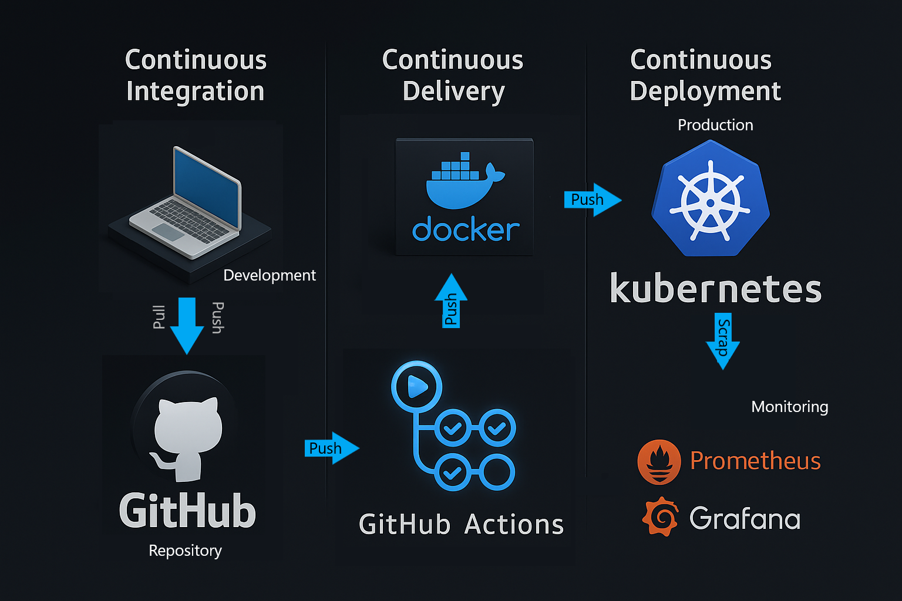

# 🚀 Proyecto Básico End-to-End — Camilo Martínez

**Resumen corto**

Este repositorio muestra un flujo mínimo pero completo de DevOps: aplicación Node.js → Docker → Kubernetes (Minikube) → CI (GitHub Actions) → Monitoreo (Prometheus + Grafana). El objetivo es que cualquier evaluador pueda clonar el repo, reproducir el entorno localmente y entender el pipeline con la documentación incluida.

---



## 🎯 Objetivos del proyecto
- Construir y contenerizar una aplicación de ejemplo (Node.js).
- Desplegar la app en Kubernetes (Minikube).
- Implementar un pipeline CI que construya y publique la imagen (GitHub Actions).
- Exponer métricas desde la app y visualizarlas en Grafana (Prometheus como scraper).
- Documentar todo el flujo para que sea reproducible y demostrable en el portafolio.

---

## 🧰 Tecnologías principales
- Node.js (Express + Socket.io)
- Docker
- Kubernetes (Minikube)
- GitHub Actions (CI)
- Prometheus + Grafana (Monitoreo)

---

## 📁 Estructura del repositorio
```
end-to-end/
├── nodeApp/                     # Código de la aplicación (index.js, package.json, public/)
├── nodeApp_k8s/                 # Manifests Kubernetes (deployment.yaml, service.yaml)
├── monitoring/                  # Artefactos de monitoring
│   ├── prometheus-cm.yaml       # snippets para prometheus configmap
│   └── grafana-dashboard.json   # dashboard exportado para versionar
├── .github/
│   └── workflows/
│       └── docker-build-push.yml
├── Dockerfile
├── README.md                    # Este documento
└── docs/img/                    # Screenshots e imágenes para README
```

---

## ⚡ Quickstart — reproducir en 10–15 minutos (pasos mínimos)
> Requisitos: Docker Desktop, kubectl, minikube, git.

1. Clona el repo
```bash
git clone https://github.com/camilomrtz/end-to-end
cd end-to-end
```

2. Construir la imagen local (opcional si vas a usar minikube docker-env)
```bash
# Opción A: construir local y probar con Docker
docker build -t devops-monitor:local ./nodeApp
docker run -p 3000:3000 devops-monitor:local
# -> abrir http://localhost:3000

# Opción B: usar el daemon Docker de Minikube (recomendado para pruebas en-cluster)
eval $(minikube -p minikube docker-env)
docker build -t devops-monitor:latest ./nodeApp
```

3. Aplicar manifests en Minikube
```bash
kubectl apply -f nodeApp_k8s/deployment.yaml
kubectl apply -f nodeApp_k8s/service.yaml
```

4. Verificar que el pod y servicio están corriendo
```bash
kubectl get pods -n default
kubectl get svc -n default
minikube service nodeapp-service -n default --url
```

5. Verificar `/metrics` (Prometheus target)
- Desde fuera: usa la URL que devuelve `minikube service ... --url` y añade `/metrics`.
- Desde dentro del cluster (pod):
```bash
kubectl run --rm -i --tty curl --image=curlimages/curl --restart=Never -- \
  sh -c "curl -sS http://nodeapp-service:3000/metrics | sed -n '1,40p'"
```
(En PowerShell quita la parte `\ sh -c` y ejecuta: `kubectl run curl --rm -it --image=curlimages/curl --restart=Never -- curl -s http://nodeapp-service:3000/metrics`)

---

## 🧩 CI/CD — GitHub Actions 

**Archivo**: `.github/workflows/docker-build-push.yml` (ya incluido)

**Secrets necesarios en GitHub** (`Settings -> Secrets and variables -> Actions`):
- `DOCKERHUB_USERNAME` → tu usuario DockerHub
- `DOCKERHUB_TOKEN` → token de acceso (no tu contraseña)

**Trigger**: por defecto el workflow está configurado para ejecutarse en `master` (o la rama principal que uses). Puedes usar `workflow_dispatch` para ejecución manual.

Si necesita el snippet del workflow, está incluido en el repo en la ruta indicada.

---

## 📊 Monitoreo — Prometheus & Grafana
### 1) Configurar Prometheus
- Si Prometheus se instaló con Helm/stack, edita su `prometheus.yml` (desde el ConfigMap) para añadir un job scrape para `nodeapp`, por ejemplo:
```yaml
- job_name: 'nodeapp'
  metrics_path: /metrics
  static_configs:
    - targets: ['nodeapp-service.default.svc.cluster.local:3000']
```
- Después recarga/reinicia Prometheus:
```bash
kubectl -n monitoring rollout restart deployment prometheus-deployment
# o borra el pod para que se regenere
kubectl -n monitoring delete pod -l app=prometheus
```

### 2) Importar dashboard en Grafana
- Interface: **Configuration → Data sources**: añadir Prometheus (URL interna: `http://prometheus-server.monitoring.svc.cluster.local:9090` o usar `localhost:9090` si haces port-forward).
- Importar JSON: **Create → Import → Upload JSON** y selecciona `monitoring/grafana-dashboard.json` del repo.

> En el repo existe el archivo `monitoring/grafana-dashboard.json` con el dashboard exportado.


---

## ⚠️ Troubleshooting (problemas comunes)
- **Prometheus target DOWN**: verifica `kubectl get endpoints nodeapp-service -n default` y la URL `http://nodeapp-service:3000/metrics` desde dentro del cluster.
- **Grafana no muestra métricas**: confirmar Data Source apuntando al Prometheus correcto y que el job `nodeapp` esté UP en `/targets`.


## 🤝 Contacto / Autor
Camilo Martínez — camilomrtz (GitHub)


